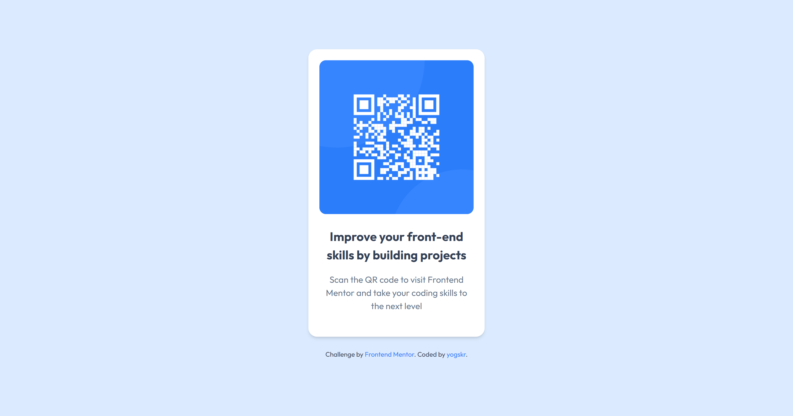

# Frontend Mentor - QR code component solution

This is a solution to the [QR code component challenge on Frontend Mentor](https://www.frontendmentor.io/challenges/qr-code-component-iux_sIO_H). Frontend Mentor challenges help you improve your coding skills by building realistic projects.

## Table of contents

- [Overview](#overview)
  - [Screenshot](#screenshot)
  - [Links](#links)
- [The process](#the-process)
  - [Built with](#built-with)
  - [Useful resources](#useful-resources)
- [Author](#author)

## Overview

### Screenshot

#### Mobile Version

#### Desktop Version

### Links

- Solution URL: [https://www.frontendmentor.io/solutions/qr-code-component-using-tailwind-css-AMUu2xwe7W](https://www.frontendmentor.io/solutions/qr-code-component-using-tailwind-css-AMUu2xwe7W)
- Live Site URL: [https://yogskr.github.io/qr-code-component/](https://yogskr.github.io/qr-code-component/)

## The process

### Built with

- Semantic HTML5 markup
- Flexbox
- Mobile-first workflow
- [TailwindCSS](https://tailwindcss.com/) - CSS Library

### Useful resources

- [Tailwind Documentation](https://tailwindcss.com/docs/installation) - The Tailwind CSS documentation helps me find components that I need to style the web page.

## Author

- Website - [Yoga Krisanta](https://yogskr.github.io/personal-website)
- Frontend Mentor - [@yogskr](https://www.frontendmentor.io/profile/yogskr)
- GitHub - [@yogskr](https://www.github.com/yogskr)
