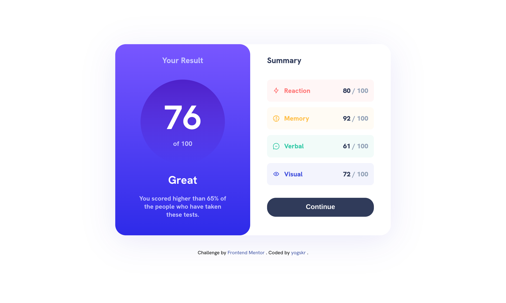
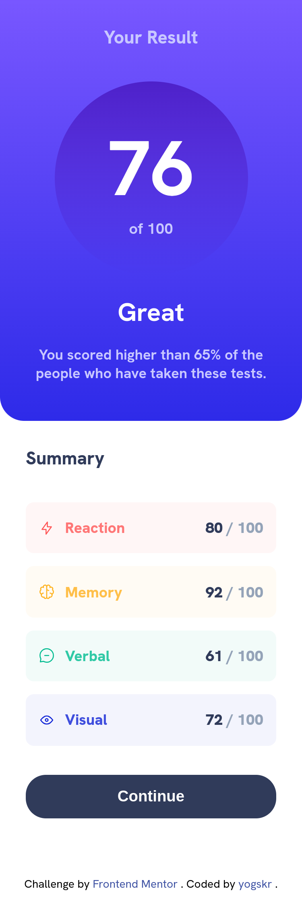

# Frontend Mentor - Results summary component solution

This is a solution to the [Results summary component challenge on Frontend Mentor](https://www.frontendmentor.io/challenges/results-summary-component-CE_K6s0maV).

## Table of contents

- [Overview](#overview)
  - [The challenge](#the-challenge)
  - [Screenshot](#screenshot)
  - [Links](#links)
- [My process](#my-process)
  - [Built with](#built-with)
  - [What I learned](#what-i-learned)
- [Author](#author)

## Overview

### The challenge

Users should be able to:

- View the optimal layout for the interface depending on their device's screen size
- See hover and focus states for all interactive elements on the page

### Screenshot

#### Desktop Preview (1440px)

#### Mobile Preview (375px)

### Links

- Solution URL: [https://www.frontendmentor.io/solutions/responsive-results-summary-component-using-flexbox-HhzzPfCIxd](https://www.frontendmentor.io/solutions/responsive-results-summary-component-using-flexbox-HhzzPfCIxd)
- Live Site URL: [https://yogskr.github.io/results-summary-component/](https://yogskr.github.io/results-summary-component/)

## My process

### Built with

- HTML5
- CSS3
- Flexbox

### What I learned

From this project, I learned how to create a responsive website element using CSS Flexbox. So far, I experienced no issue while creating the project. However, I sometimes forget how to implement several CSS properties, so I need to check the documentation.

## Author

- Website - [Yoga Krisanta](https://yogskr.github.io/personal-website)
- Frontend Mentor - [@yogskr](https://www.frontendmentor.io/profile/yogskr)
- GitHub - [@yogskr](https://www.github.com/yogskr)
- Twitter - [@yogskr\_](https://www.twitter.com/yogskr_)
