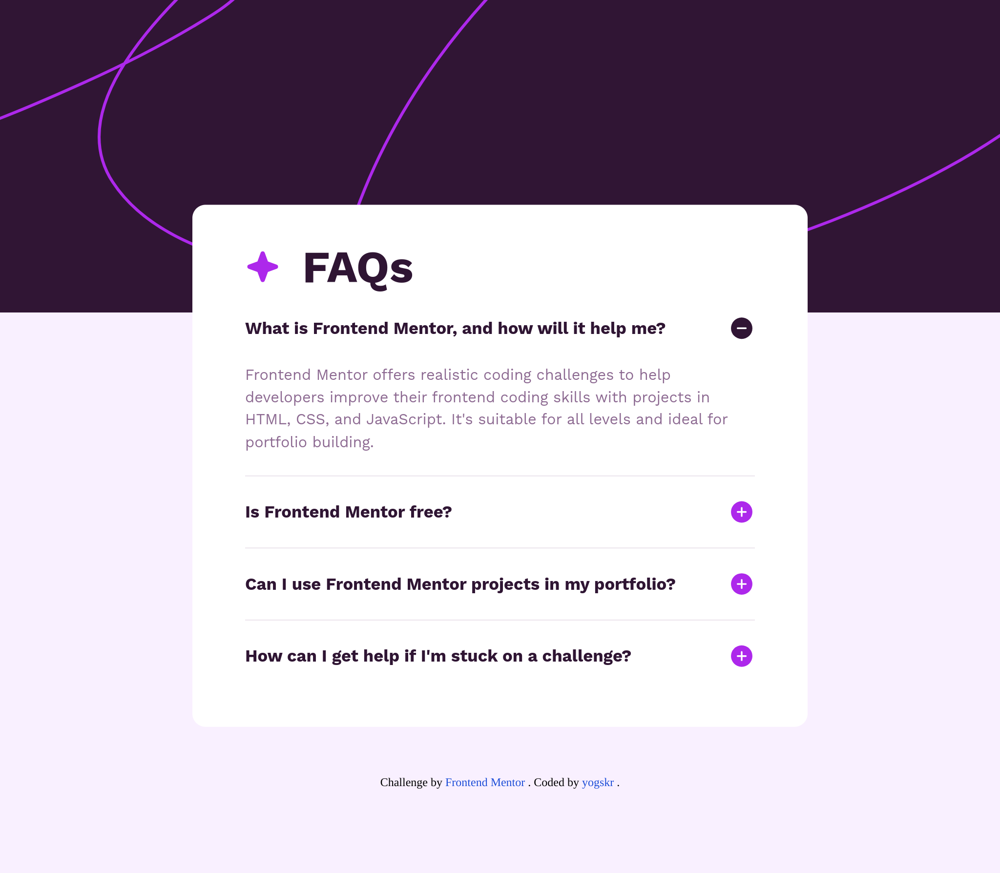
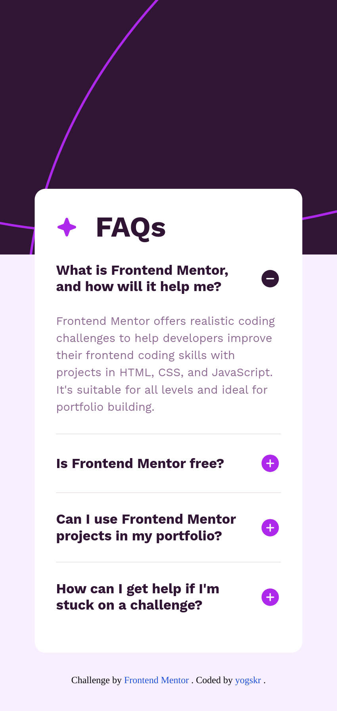

# Frontend Mentor - FAQ accordion solution

This is a solution to the [FAQ accordion challenge on Frontend Mentor](https://www.frontendmentor.io/challenges/faq-accordion-wyfFdeBwBz). Frontend Mentor challenges help you improve your coding skills by building realistic projects.

## Table of contents

- [Overview](#overview)
  - [The challenge](#the-challenge)
  - [Screenshot](#screenshot)
  - [Links](#links)
- [My process](#my-process)
  - [Built with](#built-with)
  - [What I learned](#what-i-learned)
  - [Useful resources](#useful-resources)
- [Author](#author)

## Overview

### The challenge

Users should be able to:

- Hide/Show the answer to a question when the question is clicked
- Navigate the questions and hide/show answers using keyboard navigation alone
- View the optimal layout for the interface depending on their device's screen size
- See hover and focus states for all interactive elements on the page

### Screenshot

#### Desktop Screenshot\*\*



#### Mobile Screenshot



### Links

- Solution URL: [Add solution URL here](https://your-solution-url.com)
- Live Site URL: [https://yogskr.github.io/faq-accordion/](https://yogskr.github.io/faq-accordion/)

## My process

### Built with

- Semantic HTML5 markup
- CSS custom properties
- Flexbox
- JavaScript
- Mobile-first workflow

### What I learned

In this project, I learned how to implement DOM (Document Object Model) to show and hide content after clicking on the specified element.

Since there are multiple same classes, I use `document.querySelectorAll('.element')` to get the reference of the elements.

For example:

```js
const question = document.querySelectorAll('.question');
const answer = document.querySelectorAll('.answer');
```

Then, I use the `for` loop to iterate the elements and add `document.addEventListener('click', function () {})` to create the functionality.

For instance:

```js
for (let i = 0; i < question.length; i++) {
  question[i].addEventListener('click', () => {
    minusIcon[i].classList.toggle('active');
    plusIcon[i].classList.toggle('hidden');

    if (answer[i].style.maxHeight) {
      answer[i].style.maxHeight = null;
    } else {
      answer[i].style.maxHeight = answer[i].scrollHeight + 'px';
    }
  });
}
```

### Useful resources

- [W3Schools](https://www.w3schools.com/howto/howto_js_accordion.asp) - This site helps me understand the basic on how to add the 'accordion' functionality.

## Author

- Website - [Yoga Krisanta](https://yogskr.github.io/personal-website)
- Frontend Mentor - [@yogskr](https://www.frontendmentor.io/profile/yogskr)
- GitHub - [@yogskr](https://www.github.com/yogskr)
- Twitter - [@yogskr\_](https://www.twitter.com/yogskr_)
