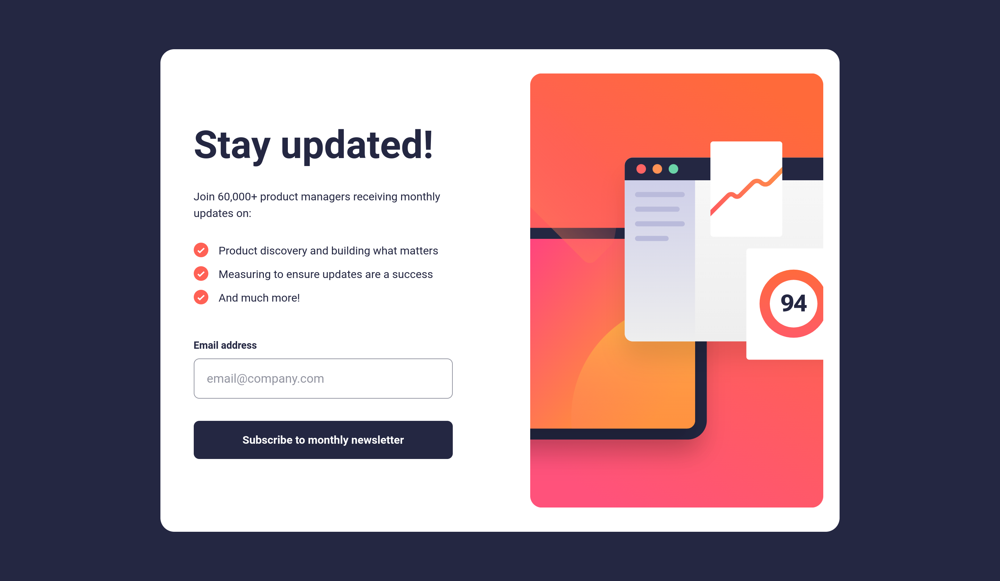
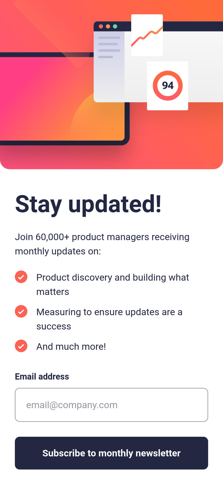

# Frontend Mentor - Newsletter sign-up form with success message solution

This is a solution to the [Newsletter sign-up form with success message challenge on Frontend Mentor](https://www.frontendmentor.io/challenges/newsletter-signup-form-with-success-message-3FC1AZbNrv). Frontend Mentor challenges help you improve your coding skills by building realistic projects.

## Table of contents

- [Overview](#overview)
  - [The challenge](#the-challenge)
  - [Screenshot](#screenshot)
  - [Links](#links)
- [My process](#my-process)
  - [Built with](#built-with)
  - [What I learned](#what-i-learned)
  - [Continued development](#continued-development)
- [Author](#author)

## Overview

### The challenge

Users should be able to:

- Add their email and submit the form
- See a success message with their email after successfully submitting the form
- See form validation messages if:
  - The field is left empty
  - The email address is not formatted correctly
- View the optimal layout for the interface depending on their device's screen size
- See hover and focus states for all interactive elements on the page

### Screenshot

**Desktop Screenshot**

**Mobile Screenshot**

### Links

- Solution URL: [https://www.frontendmentor.io/solutions/responsive-newsletter-sign-up-using-vanilla-javascript-and-css-flexbox-1dg0qxxaRt](https://www.frontendmentor.io/solutions/responsive-newsletter-sign-up-using-vanilla-javascript-and-css-flexbox-1dg0qxxaRt)
- Live Site URL: [https://yogskr.github.io/frontend-mentor-challenges/5-newsletter-sign-up](https://yogskr.github.io/frontend-mentor-challenges/5-newsletter-sign-up)

## My process

### Built with

- Semantic HTML5 markup
- CSS custom properties
- Flexbox
- JavaScript
- Mobile-first workflow

### What I learned

This project helps me learn Document Object Model (DOM) for validating email address, showing a custom error message, and showing a modal window with a success message.

I encountered a challenge where the page keeps refershing when I clicked on the Submit button. After some debugging, I found out that the issue was because I use the `<button>` tag. Therefore, I changed it to `
` and the issue was solved.

Still, I haven't found the reason why the code won't work if I use `<button>`.

### Continued development

I still need to learn more about Document Object Model (DOM), so I can understand which method to use when creating functionalities.

## Author

- Website - [Yoga Krisanta](https://yogskr.github.io/personal-website)
- Frontend Mentor - [@yogskr](https://www.frontendmentor.io/profile/yogskr)
- GitHub - [@yogskr](https://www.github.com/yogskr)
- Twitter - [@yogskr\_](https://www.twitter.com/yogskr_)
