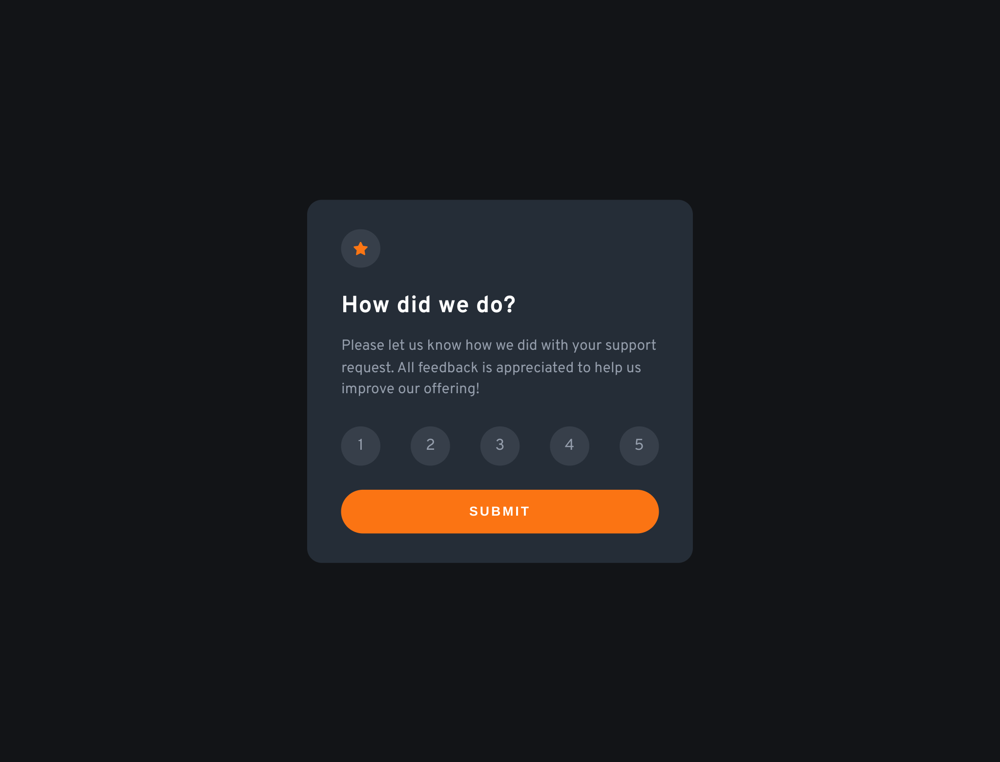

# Frontend Mentor - Interactive rating component solution

This is a solution to the [Interactive rating component challenge on Frontend Mentor](https://www.frontendmentor.io/challenges/interactive-rating-component-koxpeBUmI). Frontend Mentor challenges help you improve your coding skills by building realistic projects.

## Table of contents

- [Overview](#overview)
  - [The challenge](#the-challenge)
  - [Screenshot](#screenshot)
  - [Links](#links)
- [My process](#my-process)
  - [Built with](#built-with)
  - [What I learned](#what-i-learned)
- [Author](#author)

## Overview

### The challenge

Users should be able to:

- View the optimal layout for the app depending on their device's screen size
- See hover states for all interactive elements on the page
- Select and submit a number rating
- See the "Thank you" card state after submitting a rating

### Screenshot

#### Mobile Screenshot


#### Desktop Screenshot



### Links

- Solution URL: [Add solution URL here](https://your-solution-url.com)
- Live Site URL: [https://yogskr.github.io/frontend-mentor/6-interactive-rating-component](https://yogskr.github.io/frontend-mentor/6-interactive-rating-component)

## My process

### Built with

- Semantic HTML5 markup
- CSS custom properties
- CSS Flexbox
- JavaScript
- Mobile-first workflow

### What I learned

In this project, I learn how to build an interactive rating system using HTML, CSS, and JavaScript.

The functionality for giving the rating is quite challenging. I need to loop through all the `rate-number` element and change the style, such as `background-color` and `color`.

I encountered a hiccup when selecting another `rate-number` element while the other one is already selected. My solution is to create a function called `resetRating()` which restarts the styling of the previous selected `rate-number` element.

```js
const resetRatings = () => {
  rateNum.forEach((rating) => {
    rating.classList.remove('active');
  });
};
```

## Author

- Website - [Yoga Krisanta](https://yogskr.github.io/personal-website)
- Frontend Mentor - [@yogskr](https://www.frontendmentor.io/profile/yogskr)
- GitHub - [@yogskr](https://www.github.com/yogskr)
- Twitter - [@yogskr\_](https://www.twitter.com/yogskr_)
