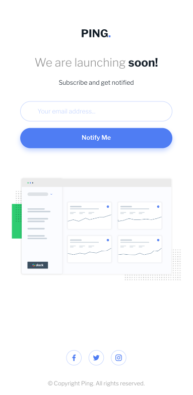
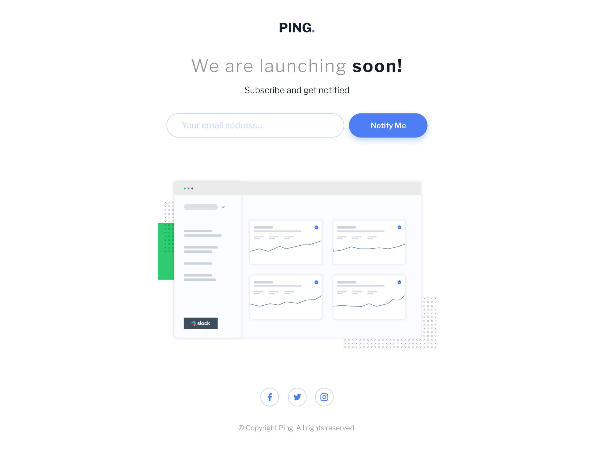

# Frontend Mentor - Ping coming soon page solution

This is a solution to the [Ping coming soon page challenge on Frontend Mentor](https://www.frontendmentor.io/challenges/ping-single-column-coming-soon-page-5cadd051fec04111f7b848da). Frontend Mentor challenges help you improve your coding skills by building realistic projects.

## Table of contents

- [Overview](#overview)
  - [The challenge](#the-challenge)
  - [Screenshot](#screenshot)
  - [Links](#links)
- [My process](#my-process)
  - [Built with](#built-with)
  - [What I learned](#what-i-learned)
  - [Continued development](#continued-development)
  - [Useful resources](#useful-resources)
- [Author](#author)

**Note: Delete this note and update the table of contents based on what sections you keep.**

## Overview

### The challenge

Users should be able to:

- View the optimal layout for the site depending on their device's screen size
- See hover states for all interactive elements on the page
- Submit their email address using an `input` field
- Receive an error message when the `form` is submitted if:
  - The `input` field is empty. The message for this error should say _"Whoops! It looks like you forgot to add your email"_
  - The email address is not formatted correctly (i.e. a correct email address should have this structure: `name@host.tld`). The message for this error should say _"Please provide a valid email address"_

### Screenshot

#### Mobile Screenshot

#### Desktop Screenshot

### Links

- Solution URL: [Add solution URL here](https://your-solution-url.com)
- Live Site URL: [https://yogskr.github.com/frontend-mentor/7-coming-soon-page](https://yogskr.github.com/frontend-mentor/7-ping-coming-soon-page)

## My process

### Built with

- Semantic HTML5 markup
- CSS custom properties
- CSS Flexbox
- JavaScript
- Mobile-first workflow

### What I learned

Another DOM project that's quite fun and quite challenging. I learned a lot about CSS properties, such as using them to position the `error-msg` element.

I also learned about using media query in JavaScript. With that, I can set different functionality for the `error-msg` element when I click the **Notify Me** button.

### Continued development

Armed with this knowledge, I'll use it for my upcoming landing page project.

### Useful resources

- [W3Schools - Media Queries with JavaScript](https://www.w3schools.com/howto/howto_js_media_queries.asp) - This resource helped me for understanding how to remove a functionality when the media query changes.

## Author

- Website - [Yoga Krisanta](https://yogskr.github.io/personal-website)
- Frontend Mentor - [@yogskr](https://www.frontendmentor.io/profile/yogskr)
- GitHub - [@yogskr](https://www.github.com/yogskr)
- Twitter - [@yogskr\_](https://www.twitter.com/yogskr_)
